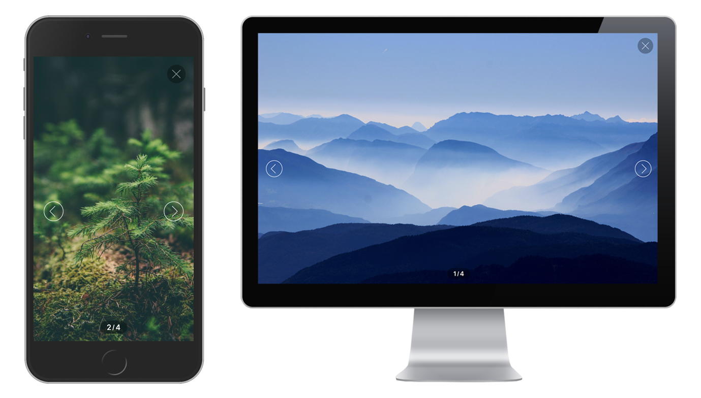

# Lightningbox

A small (**2.2kB gzipped**) and blazing fast vanilla javascript image viewer. [View Demo](https://lightningbox.leventebalogh.com)



## Install
```bash
$ npm install --save lightningbox
```

## Usage
**API**
```javascript
/**
* Takes a selector and initialises the image-viewer for the matched element(s).
* The selector needs to point to a single or multiple <a> elements.
* Whenever the <a> elements are clicked the image-viewer will open.
* Required <a> parameters:
*
*    href="..." => the URL of the image that will be displayed in the modal
*
* @param {string} selector The selector of the <a> element(s)
*/
function lightningbox (selector) {
    // ...
}
```

**Single Image**
```javascript
import lightningbox from 'lightningbox';

lightningbox('.gallery > a');
```
```html
<div class="gallery">
    <a href="/images/1.jpg" title="First"></a>
</div>
```

**Multiple Images**
```javascript
import lightningbox from 'lightningbox';

lightningbox('.gallery > a');
```
```html
<div class="gallery">
    <a href="/images/1.jpg" title="First"></a>
    <a href="/images/2.jpg" title="Second"></a>
    <a href="/images/3.jpg" title="Third"></a>
</div>
```

**Using CDN**
```html
<head>
    <!-- Stylesheet -->
    <link rel="stylesheet" href="https://cdn.jsdelivr.net/npm/lightningbox@latest/dist/lightningbox.min.css" />
</head>
<body>
    <div class="gallery">
        <a href="/images/1.jpg" title="First"></a>
        <a href="/images/2.jpg" title="Second"></a>
        <a href="/images/3.jpg" title="Third"></a>
    </div>
    <!-- Javascript -->
    <script type="text/javascript" src="https://cdn.jsdelivr.net/npm/lightningbox@latest/dist/lightningbox.min.js"></script>
    <script>
        window.lightningbox('.gallery > a');
    </script>
</body>
```

**Using NPM**

The `lightningbox` module exposes the `lightningbox()` function only which you can start using right away.
```javascript
import lightningbox from 'lightningbox';

lightningbox('.gallery > a');
```

**Styling**

You can either use the compiled `lightningbox.min.css` file or you can require in the SASS file from
`node_modules/lightningbox/src/style.scss`.

Customizable SASS variables:
```
$gutter                 // The default spacing used
$color                  // Text color
$font-family            // Font family
$background             // Background color of the modal
$nav-background         // Background color of the close button
$pagination-background  // Background color of the pagination
$border-radius:         // Default border radius
$transition-time:       // Default transition times
```

## CDN
Just use the following code to make `window.lightningbox` available on your site.
```html
<script type="text/javascript" src="https://cdn.jsdelivr.net/npm/lightningbox@latest/dist/lightningbox.min.js"></script>
<link rel="stylesheet" href="https://cdn.jsdelivr.net/npm/lightningbox@latest/dist/lightningbox.min.css" />
```


## Development
```bash
# Run webpack-dev-server and example page on http://localhost:8080/
$ yarn dev

# Run a production build
$ yarn build

# Run the tests
$ yarn test

# Play some TDD!
$ yarn tdd
```